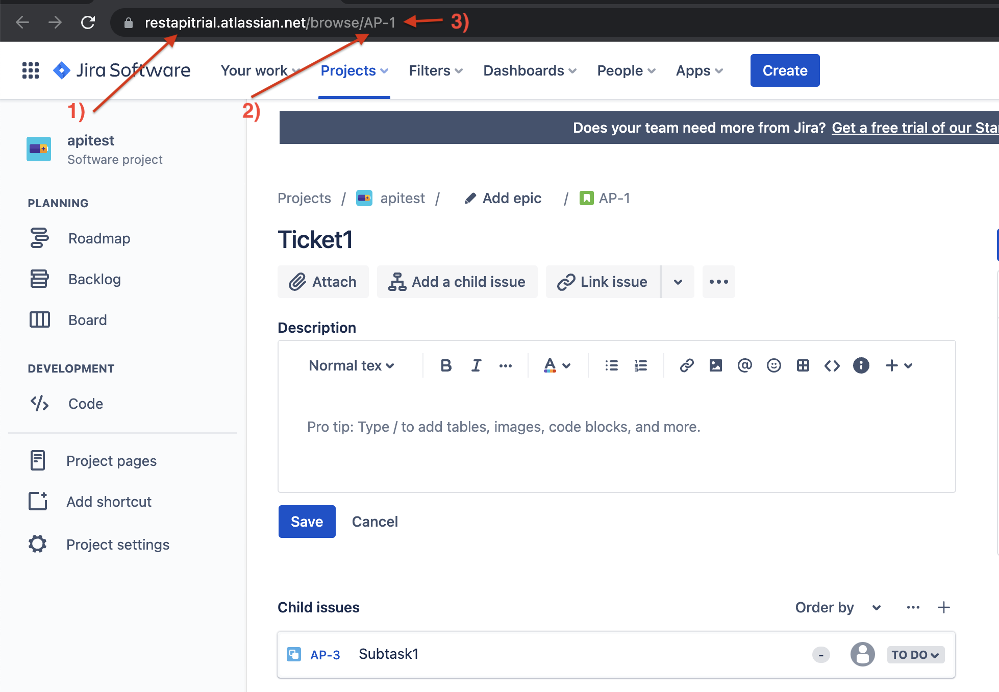

# Overview

A build extensions that comments on your JIRA tickets for you.

## Usage

- install this extension from the marketplace
- add this task to your CI pipeline & fill out your JIRA details for for more information on how to source this information, check out the [getting relevant JIRA information](#getting-relevant-jira-information) section 
    ```yaml
    - task: JiraCommenterExtension@0
      inputs:
        email: '$(email)'
        token: '$(token)'
        organisation: 'acme'
        project: 'ACM'
        ticketNumber: 42
        prLink: 'https://github.com/acme/pullrequests/1'
    ```

## Getting relevant JIRA information

To use this extension, you'll need some information.


- **email**

  is the email address of the account that will be authoring the comments. It is recommended to create a separate account and give it the least amount of permissions on your JIRA project - to view and comment on issues (tickets)
- **token**
  
  is the API token for the aforementioned account. Follow the guide [here](https://support.atlassian.com/atlassian-account/docs/manage-api-tokens-for-your-atlassian-account/) to obtain one

- **organisation**

  is the name of your organisation registered with atlassian. If you go to your project and inspect an issue, you'll be presented with a similar view to the [example](#project-example). The organisation is labelled `1)`, in this case - `restapitrial`. 

- **project**

  is the project key of the project that a ticket is in. If you go to your project and inspect an issue, you'll be presented with a similar view to the [example](#project-example). The project key is labelled `2)`, in this case - `AP`. 

- **tickeNumber**

  number of the ticket you want to comment on. If you go to your project and inspect an issue, you'll be presented with a similar view to the [example](#project-example). The ticket number is labelled `3)`, in this case - `1`
- **prLink**

  needs to conform to [RFC-3986](https://datatracker.ietf.org/doc/html/rfc3986). Most importantly, it needs to be a URI that's using the https scheme, e.g. https://github.com/acme/pullrequests/1


### Project example

