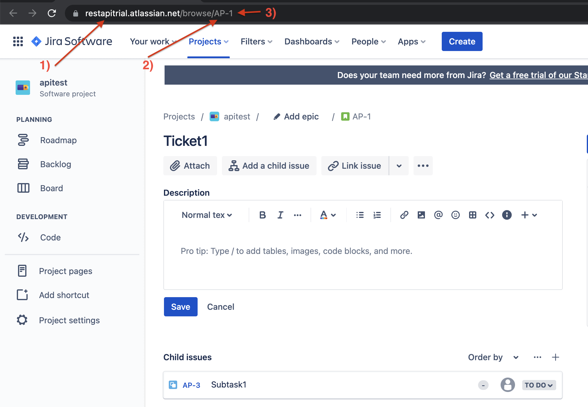

# Overview

When working on large projects with many contributors, cross-referencing commits that implement a particular JIRA ticket can be highly beneficial. However, achieving this manually can be quite dull and time consuming.

This build pipeline extension will help you link your PRs with your JIRA tickets.

It's important to note that this extension's responsiblity is only the creation of a comment on a particular JIRA ticket. Because there are many ways to to correlate a ticket with its implementation, all of which rely on the user's choice, the extension doesn't include the logic to figure out which JIRA ticket does a commit relate to.

This means you'll need to name your branches/craft your PR commit messages in a way that correlates them with a JIRA ticket, so that you can extract the information further down the CI pipeline and pass it to this extension (mainly `ticketNumber` and `prLink`, unless you're working with multiple JIRA projects, then you'll need to dynamically inject `organisation` and `project` too).

## Usage

- install this extension from the [marketplace](https://marketplace.visualstudio.com/items?itemName=AdrianSoomro.jira-commenter-task)
- add this task to your CI pipeline & fill out your JIRA details. For more information on how to source this information, check out the [getting relevant JIRA information](#getting-relevant-jira-information) section
  ```yaml
  - task: JiraCommenterExtension@1
    inputs:
      email: "$(email)"
      token: "$(token)"
      organisation: "acme"
      project: "ACM"
      ticketNumber: 42
      prLink: "https://github.com/acme/pullrequests/1"
  ```

It is recommended to only run this task once in your CI process, preferably after a successful merge of a PR, to avoid spamming your JIRA tickets.

## Getting relevant JIRA information

To use this extension, you'll need some information.

- **email**

  is the email address of the account that will be authoring the comments. It is recommended to create a separate account and give it the least amount of permissions on your JIRA project - to view and comment on issues (tickets).

- **token**

  is the API token for the aforementioned account. Follow the guide [here](https://support.atlassian.com/atlassian-account/docs/manage-api-tokens-for-your-atlassian-account/) to obtain one.

- **organisation**

  is the name of your organisation registered with atlassian. If you go to your project and inspect an issue, you'll be presented with a similar view to the [example](#project-example). The organisation is labelled `1)`, in this case - `restapitrial`.

- **project**

  is the project key of the project that a ticket is in. If you go to your project and inspect an issue, you'll be presented with a similar view to the [example](#project-example). The project key is labelled `2)`, in this case - `AP`.

- **tickeNumber**

  number of the ticket you want to comment on. If you go to your project and inspect an issue, you'll be presented with a similar view to the [example](#project-example). The ticket number is labelled `3)`, in this case - `1`.

- **prLink**

  needs to conform to [RFC-3986](https://datatracker.ietf.org/doc/html/rfc3986). Most importantly, it needs to be a URI that's using the https scheme, e.g. https://github.com/acme/pullrequests/1.

  Your build agent should have enough information to allow you to construct the link to the PR through a shell script.

  To see the information available to the build agent at runtime, add a shell script that'll print all the environment variables.

  ```yaml
  steps:
    - task: Bash@3
      inputs:
        targetType: "inline"
        script: printenv | sort
  ```

### Project example


